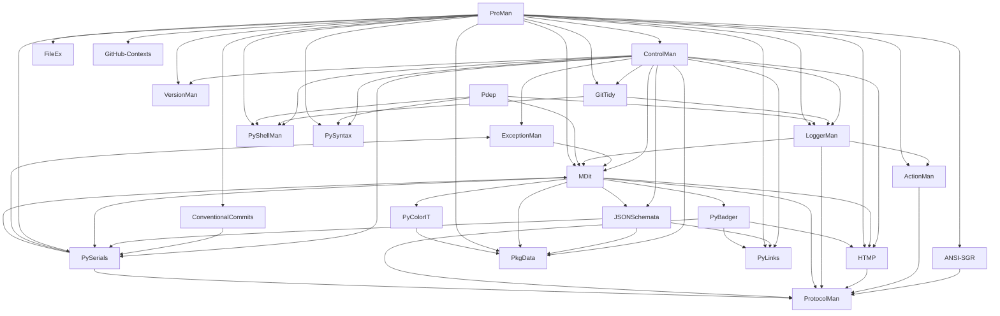

## Dependencies

- **ANSI-SGR**:
  - Internals: `ProtocolMan`
  - Externals: `wcwidth`
- **ActionMan**:
  - Internals: `ProtocolMan`
  - Externals: `rich`
- **ControlMan**:
  - Internals: `ExceptionMan`  `GitTidy`  `HTMP`  `JSONSchemata`  `LoggerMan`  `MDit`  `PkgData`  `PyLinks`  `PySerials`  `PyShellMan`  `PySyntax`  `VersionMan`
  - Externals: `jsonpath-ng`  `jsonschema`  `packaging`  `referencing`  `ruamel.yaml`  `trove-classifiers`
- **ConventionalCommits**:
  - Internals: `PySerials`
- **ExceptionMan**:
  - Internals: `MDit`
  - Externals: `pygments`  `rich`
- **FileEx**:
- **GitHub-Contexts**:
  - Externals: `ruamel.yaml`  `ruamel.yaml.string`
- **GitTidy**:
  - Internals: `LoggerMan`  `PyShellMan`
- **HTMP**:
  - Internals: `ProtocolMan`
  - Externals: `IPython`
- **JSONSchemata**:
  - Internals: `PkgData`  `PyLinks`  `PySerials`
  - Externals: `referencing`
- **LoggerMan**:
  - Internals: `ActionMan`  `MDit`  `ProtocolMan`
  - Externals: `pydantic`  `rich`
- **MDit**:
  - Internals: `HTMP`  `JSONSchemata`  `PkgData`  `ProtocolMan`  `PyBadger`  `PyColorIT`  `PySerials`
  - Externals: `IPython`  `cmarkgfm`  `jupyterlab_myst`  `linkify-it-py`  `markdown-it-py`  `mdit-py-plugins`  `myst-parser`  `pydantic`  `pydata-sphinx-theme`  `pygments`  `readme-renderer`  `referencing`  `rich`  `sphinx`  `sphinx-design`  `sphinx-togglebutton`  `zundler`
- **Pdep**:
  - Internals: `LoggerMan`  `MDit`  `PyShellMan`  `PySyntax`
  - Externals: `packaging`  `requirements-parser`
- **PkgData**:
- **ProMan**:
  - Internals: `ANSI-SGR`  `ActionMan`  `ControlMan`  `ConventionalCommits`  `FileEx`  `GitHub-Contexts`  `GitTidy`  `HTMP`  `LoggerMan`  `MDit`  `PkgData`  `PyLinks`  `PySerials`  `PyShellMan`  `PySyntax`  `VersionMan`
  - Externals: `pre-commit`
- **ProtocolMan**:
- **PyBadger**:
  - Internals: `HTMP`  `ProtocolMan`  `PyLinks`
  - Externals: `IPython`
- **PyColorIT**:
  - Internals: `PkgData`
  - Externals: `ipython`  `numpy`
- **PyLinks**:
  - Externals: `requests`
- **PySerials**:
  - Internals: `ExceptionMan`  `MDit`  `ProtocolMan`
  - Externals: `jsonpath-ng`  `jsonschema`  `referencing`  `ruamel.yaml`  `ruamel.yaml.string`  `tomlkit`
- **PyShellMan**:
  - Externals: `rich`
- **PySyntax**:
- **RetryIT**:
- **VersionMan**:
  - Externals: `packaging`

### Internal Dependency Graph

